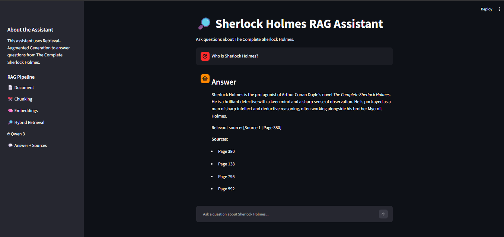
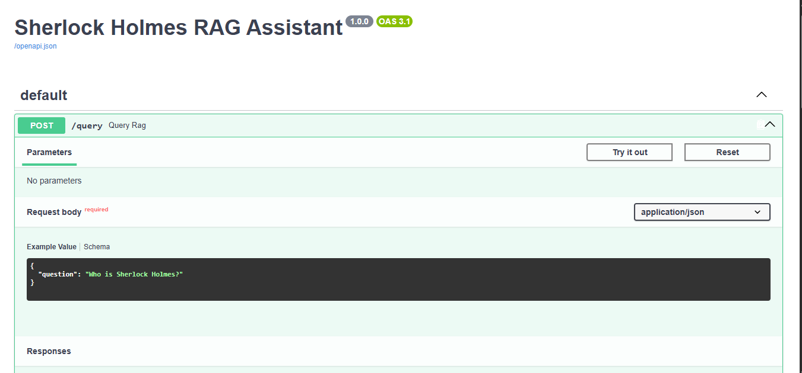
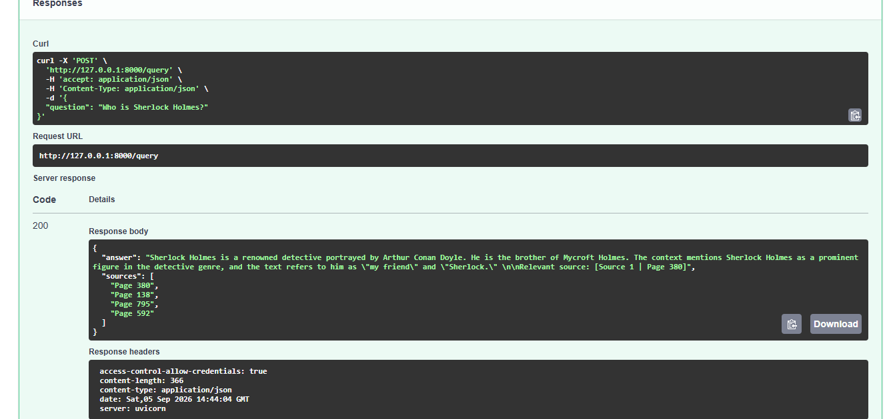

# 🔎 Sherlock Holmes RAG Assistant

A **Retrieval-Augmented Generation (RAG)** application for answering questions about **The Complete Sherlock Holmes by Arthur Conan Doyle**.

The system retrieves relevant passages from the book and uses a local LLM to generate grounded answers with source pages.

## ✨ Features

* 📄 PDF text extraction and processing
* ✂️ Recursive text chunking
* 🧠 Semantic embeddings with `all-MiniLM-L6-v2`
* 🗄️ Persistent ChromaDB vector store
* 🔎 Hybrid retrieval using **Semantic Search + TF-IDF**
* 🤖 Local **Qwen 3 1.7B** through Ollama
* ⚡ FastAPI backend
* 💬 Streamlit chat interface
* 📚 Source page references
* 🧪 Automated API tests

## 🏗️ Architecture

```text
PDF
  ↓
Text Extraction
  ↓
Chunking
  ↓
Embeddings
  ↓
ChromaDB
  ↓
Hybrid Retrieval
(Semantic + TF-IDF)
  ↓
Qwen 3 1.7B
  ↓
Answer + Sources
```

## 📚 Dataset

**The Complete Sherlock Holmes — Arthur Conan Doyle**

* 987 pages
* 883 pages with usable extracted text
* 104 pages without usable extracted text
* ~3.58 million extracted characters

## ⚙️ RAG Configuration

| Component        | Configuration      |
| ---------------- | ------------------ |
| Chunk size       | 1000 characters    |
| Chunk overlap    | 150 characters     |
| Embedding model  | `all-MiniLM-L6-v2` |
| Vector database  | ChromaDB           |
| Retrieval        | Hybrid             |
| Semantic weight  | 0.4                |
| Keyword weight   | 0.6                |
| Candidate chunks | 20                 |
| Final chunks     | 5                  |
| LLM              | Qwen 3 1.7B        |

## 🛠️ Tech Stack

**Backend:** Python, FastAPI, Uvicorn, Pydantic

**RAG:** Sentence Transformers, ChromaDB, Scikit-learn, TF-IDF

**LLM:** Qwen 3 1.7B, Ollama

**Frontend:** Streamlit

**Testing:** Pytest

**Tools:** Jupyter, VS Code, Git, GitHub, Docker

## 📁 Project Structure

```text
RAG_Assistant_Project/
│
├── data/
│   ├── vector_store/
│   └── rag_config.json
│
├── notebooks/
│   └── rag_pipeline.ipynb
│
├── backend/
│   ├── app/
│   │   ├── main.py
│   │   ├── api/routes/query.py
│   │   ├── core/config.py
│   │   ├── schemas/query.py
│   │   ├── services/
│   │   │   ├── retrieval.py
│   │   │   └── generation.py
│   │   └── utils/logging_config.py
│   │
│   ├── tests/test_query.py
│   ├── requirements.txt
│   ├── .env.example
│   ├── Dockerfile
│   └── .dockerignore
│
├── frontend/
│   ├── app.py
│   ├── api_client.py
│   ├── .env.example
│   └── requirements.txt
│
├── .gitignore
└── README.md
```

## 🚀 Setup

### 1. Clone the repository

```bash
git clone https://github.com/Mariam-osama5/sherlock-holmes-rag-assistant.git
cd sherlock-holmes-rag-assistant
```

### 2. Create a virtual environment

```bash
python -m venv .venv
```

**Windows PowerShell:**

```powershell
.\.venv\Scripts\Activate.ps1
```

### 3. Install dependencies

```bash
pip install -r backend/requirements.txt
pip install -r frontend/requirements.txt
```

### 4. Prepare the Vector Store

The PDF and local ChromaDB vector store are not included in the GitHub repository because they are large files.

To prepare the vector store:

1. Place `cano.pdf` inside the `data/` directory.
2. Open `notebooks/rag_pipeline.ipynb`.
3. Select the project virtual environment as the Jupyter kernel.
4. Run the notebook from top to bottom.
5. The notebook extracts the PDF text, creates chunks, generates embeddings, and persists the ChromaDB vector store in:

```text
data/vector_store/
```

After this step, the FastAPI backend can load the existing vector store directly without rebuilding it for every request.

### 5. Install and run Ollama

Pull the required model:

```bash
ollama pull qwen3:1.7b
```

Make sure Ollama is running before starting the backend.

### 6. Configure environment variables

Create:

```text
backend/.env
frontend/.env
```

using the provided `.env.example` files.

#### Backend — `backend/.env`

| Variable          | Description                           | Example                  |
| ----------------- | ------------------------------------- | ------------------------ |
| `OLLAMA_MODEL`    | Local Ollama LLM model                | `qwen3:1.7b`             |
| `OLLAMA_HOST`     | Ollama server address                 | `http://127.0.0.1:11434` |
| `EMBEDDING_MODEL` | Sentence Transformers embedding model | `all-MiniLM-L6-v2`       |
| `COLLECTION_NAME` | ChromaDB collection name              | `sherlock_holmes`        |
| `TOP_K`           | Number of final retrieved chunks      | `5`                      |
| `CANDIDATE_K`     | Number of retrieval candidates        | `20`                     |
| `SEMANTIC_WEIGHT` | Weight of semantic retrieval          | `0.4`                    |
| `KEYWORD_WEIGHT`  | Weight of TF-IDF keyword retrieval    | `0.6`                    |
| `FRONTEND_ORIGIN` | Allowed frontend origin for CORS      | `http://localhost:8501`  |

#### Frontend — `frontend/.env`

| Variable       | Description         | Example                 |
| -------------- | ------------------- | ----------------------- |
| `API_BASE_URL` | FastAPI backend URL | `http://127.0.0.1:8000` |

> **Note:** `.env` files are local configuration files and are excluded from Git using `.gitignore`. Do not commit them to GitHub.

## ▶️ Run the Application

### Backend

From the project root:

```powershell
cd backend

uvicorn app.main:app --reload
```

API:

```text
http://127.0.0.1:8000
```

Swagger documentation:

```text
http://127.0.0.1:8000/docs
```

Health check:

```text
http://127.0.0.1:8000/health
```

### Frontend

In another terminal:

```powershell
streamlit run frontend/app.py
```

Open:

```text
http://localhost:8501
```

## 🔌 API

### `GET /health`

Response:

```json
{
  "status": "healthy"
}
```

### `POST /query`

Request:

```json
{
  "question": "Who is Sherlock Holmes?"
}
```

Response:

```json
{
  "answer": "Sherlock Holmes is a detective...",
  "sources": [
    "Page 380",
    "Page 795"
  ]
}
```

### cURL Example

```bash
curl -X POST "http://127.0.0.1:8000/query" \
  -H "Content-Type: application/json" \
  -d "{\"question\":\"Who is Sherlock Holmes?\"}"
```

## 🧪 Testing

The backend includes tests for:

* Successful `/query` requests
* Invalid request validation

Run:

```powershell
$env:PYTHONPATH="."
pytest -q
```

Current result:

```text
2 passed
```

## 📊 Evaluation

The RAG pipeline was evaluated using different retrieval strategies and questions, including:

* Semantic retrieval
* TF-IDF retrieval
* Short-chunk filtering
* Reciprocal Rank Fusion (RRF)
* Hybrid retrieval

The notebook contains **10 evaluation questions** covering retrieval relevance, grounding, and answer correctness.

The final configuration uses:

```text
40% Semantic Retrieval
60% Keyword Retrieval
Top 5 results
20 candidates
```

The evaluation focused on retrieval relevance and whether generated answers were grounded in the provided document context.

## 🔮 Future Improvements

* OCR for non-extractable pages
* Multimodal document understanding
* Conversation memory
* Streaming responses
* Advanced reranking
* Cloud deployment

## 📸 Screenshots

### Streamlit Frontend



### FastAPI Swagger






## 👩‍💻 Author

**Mariam Osama**

AI Engineer Trainee | Machine Learning & Generative AI

GitHub:

https://github.com/Mariam-osama5